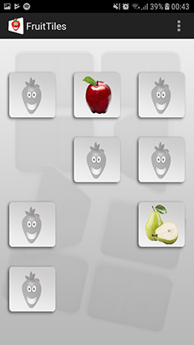

FruitTiles
==========

FruitTiles Android Game

My attempt to learn Android programming. The first code I wrote was somewhere in 2013, and only did some small updates 
a few years later. 

This little memory game has a matrix of tiles that group 2 by 2 according to the
picture on their backs. If the two turned tiles don't match they turn back around. The round ends when all tiles are
grouped. 

It was up on Google Playstore for more than 10 years before they decided to take it down because it wasn't updated in a
long while. Maybe one day I will update it and put it back up, but I kind of want to keep it as it is, a memory of how
I started with Java and Android programming.